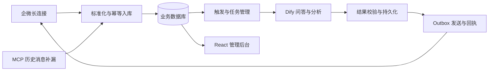

# 群知 · WeCom Mind

企业微信群聊 AI 助手：连接实时消息、知识问答、会话记忆与用户画像。

基于 **FastAPI + SQLAlchemy + Dify + React** 构建。由自建后端管理消息、任务状态及业务数据，Dify 负责问答与分析工作流；企业微信长连接承接实时交互，MCP 拉取历史消息用于补漏。

## 核心能力

- **消息接入与补漏**：长连接接收消息，MCP 历史拉取补漏，消息标准化和业务幂等处理。
- **知识问答与回复**：@ 触发问答，调用 Dify 工作流，校验结构化输出，经 outbox 记录发送状态与回执。
- **会话记忆与画像**：会话切分、用户画像分析与画像上下文构建，为个性化回复提供信息。
- **管理后台**：查看消息、AI 调用、发送任务、会话和画像，提供管理员登录与运行状态查询。
- **可测试的集成边界**：Dify 和企微均提供 mock 适配；真实模式需要自行配置服务凭据。

## 架构



主链路使用企业微信智能机器人长连接，MCP 不替代实时消息入口。知识内容与检索配置通过自行部署的 Dify 工作流接入；仓库不包含实际业务知识库、用户消息或运行数据库。

## 本地启动

以下命令用于 Windows PowerShell，从仓库根目录执行。建议 Python 3.11 或更新版本；前端构建需要 Node.js。

```powershell
python -m venv .venv
.\.venv\Scripts\python.exe -m pip install -r requirements-dev.txt
Copy-Item .env.example .env
$env:DIFY_CLIENT_MODE = "mock"
$env:WECOM_SENDER_MODE = "mock"
$env:WECOM_MCP_VERIFY_MODE = "mock"
.\.venv\Scripts\python.exe -m uvicorn app.main:app --app-dir src --host 127.0.0.1 --port 8000
```

健康检查：`http://127.0.0.1:8000/health`。现有 `.env` 请保留，不要用示例覆盖自己的配置。真实 Dify 与企微接入请先阅读 [实机配置说明](docs/dify-dsl/live-test-guide.md)，按 `.env.example` 配置个人环境。

前端开发：

```powershell
cd apps/admin-web
npm ci
npm run dev
```

管理员账号配置见 `.env.example` 中的管理端配置项。真实服务模式依赖 Dify 应用、企业微信机器人及相应权限，单独启动仓库不会自动获得这些外部能力。

## 测试与构建

```powershell
.\.venv\Scripts\python.exe -m pytest -q
.\.venv\Scripts\python.exe -m pip check
npm --prefix apps/admin-web run build
```

默认测试使用 mock / 临时数据库；测试通过不代表真实企业微信或 Dify 已完成部署验收。

## 导航

| 路径 | 内容 |
| --- | --- |
| `src/app/wecom` | 实时接入、MCP 补漏、消息幂等 |
| `src/app/dify` | Dify 调用与输出处理 |
| `src/app/conversations`、`src/app/profiles` | 会话与画像 |
| `src/app/outbound` | 发送任务与回执 |
| `apps/admin-web` | React 管理后台 |
| `docs/dify-dsl` | Dify 工作流与配置说明 |
| `tests` | 后端测试 |

- [架构与模块文档](docs/README.md)
- [企微接入模块](docs/modules/01-wecom-adapter.md)
- [数据模型](docs/architecture/data-model.md)
- [历史开发记录](docs/development-history.md)

历史文档包含不同阶段的方案与待办，应结合当前源码阅读。Redis、分布式队列与完整生产运维方案不在本仓库当前交付范围内。

## 数据与配置

环境文件、密钥备份、数据库、日志、生成输出和本地业务材料由 `.gitignore` 排除。请自行准备知识库和外部服务配置；不要提交真实用户聊天内容或凭据。
